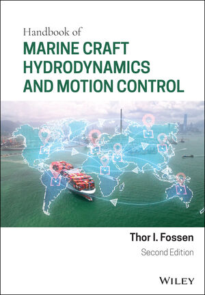

# Handbook of Marine Craft Hydrodynamics and Motion Control
2nd Edition
ISBN: 978-1-119-57505-4 March 2021 736 Pages

[Thor I. Fossen](https://www.ntnu.edu/employees/tif) 

[John Wiley & Sons Ltd. 2021](https://www.wiley.com/en-in/Handbook+of+Marine+Craft+Hydrodynamics+and+Motion+Control,+2nd+Edition-p-9781119575054l)

## Lecture Material

The following lecture slides are included as a resource for students, researchers, and instructors. 
