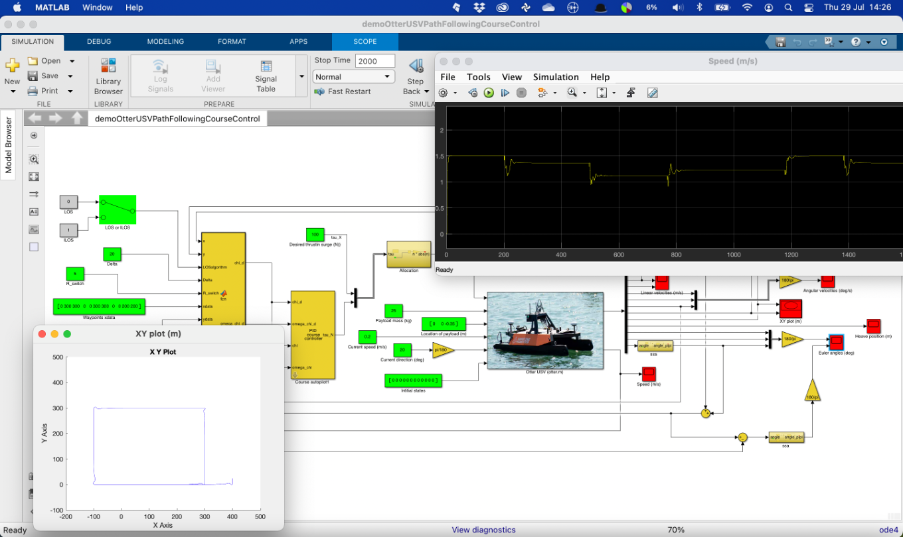
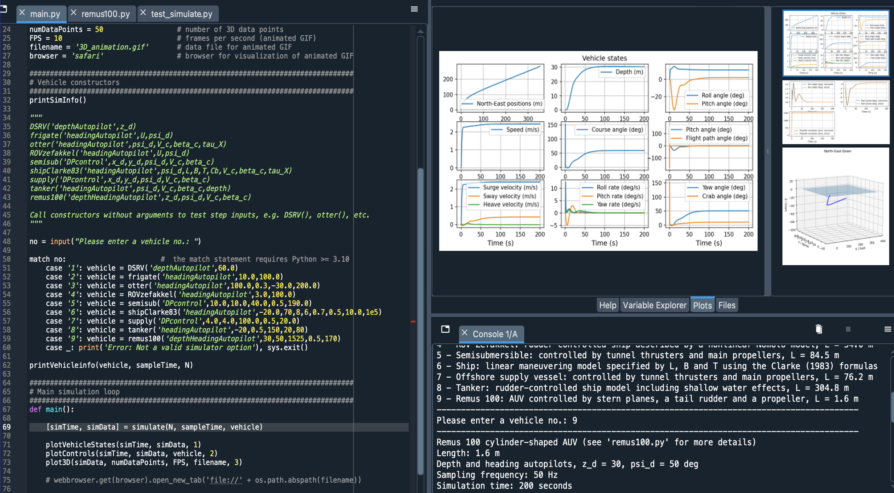

# Handbook of Marine Craft Hydrodynamics and Motion Control

The "Handbook of Marine Craft Hydrodynamics and Motion Control" comprehensively explores cutting-edge developments in marine craft hydrodynamics and guidance, navigation, and control (GNC) systems. The text establishes how mathematical models and modern control theory can be implemented to simulate and verify control systems. 

  &nbsp;&nbsp;&nbsp;  [Errata.pdf](./supplement/Errata.pdf)

ISBN: 978-1-119-57505-4

[Thor I. Fossen](https://www.ntnu.edu/employees/tif)

[John Wiley & Sons Ltd., 2nd Edition, April 2021](https://www.wiley.com/en-in/Handbook+of+Marine+Craft+Hydrodynamics+and+Motion+Control%2C+2nd+Edition-p-9781119575030)

## Lecture Material

The textbook is used in the graduate course [TTK4190 Guidance, Navigation and Control of Vehicles](https://www.ntnu.edu/studies/courses/TTK4190) at the Norwegian University of Science and Technology. Complementary slides can be downloaded below. 

| | Chapters | PDF Slides | Last Modified |
| :-: | :--- | :-: | :-: |
| | Part 1: Marine Craft Hydrodynamics |
| 1 | Introduction to Part I | [Ch1.pdf](book_chapters/Ch1.pdf)| 2024-06-17 |
| 2 | Kinematics   | [Ch2.pdf](book_chapters/Ch2.pdf)| 2024-06-17  |
| 3 | Rigid-Body Kinetics | [Ch3.pdf](book_chapters/Ch3.pdf)| 2024-06-17  |
| 4 | Hydrostatics | [Ch4.pdf](book_chapters/Ch4.pdf)| 2024-06-21  |
| 5 | Seakeeping Models | [Ch5.pdf](book_chapters/Ch5.pdf)| 2023-08-10  |
| 6 | Maneuvering Models | [Ch6.pdf](book_chapters/Ch6.pdf)| 2024-07-27  |
| 7 | Autopilot Models for Course and Heading Control | [Ch7.pdf](book_chapters/Ch7.pdf)| 2023-08-10 |
| 8 | Models for Underwater Vehicles | [Ch8.pdf](book_chapters/Ch8.pdf)| 2023-08-15  |
| 9 | Control Forces and Moments | [Ch9.pdf](book_chapters/Ch9.pdf)| 2023-03-29 |
| 10 | Environmental Forces and Moments | [Ch10.pdf](book_chapters/Ch10.pdf)| 2024-08-18 |
| | Part 2: Motion Control Systems |
| 11 | Introduction to Part II | [Ch11.pdf](book_chapters/Ch11.pdf)| 2021-05-20 |
| 12 | Guidance Systems | [Ch12.pdf](book_chapters/Ch12.pdf)| 2023-10-27 |
| 13 | Model-Based Navigation Systems | [Ch13.pdf](book_chapters/Ch13.pdf)| 2022-11-04 |
| 14 | Inertial Navigation Systems | [Ch14.pdf](book_chapters/Ch14.pdf)| 2023-08-01  |
| 15 | Motion Control Systems | [Ch15.pdf](book_chapters/Ch15.pdf)| 2023-09-02 |
| 16 | Advanced Motion Control Systems | [Ch16.pdf](book_chapters/Ch16.pdf)| 2021-06-25  |
| | Part III: Appendices |
| A | Nonlinear Stability Theory | |
| B | Numerical Methods | |
| C | Model Transformations | |
| D | Non-dimensional Equations of Motion | |

## MSS (Marine Systems Simulator)

The Marine Systems Simulator (MSS) is a complementary Matlab and Simulink library for simulating marine systems. The m-files are compatible with the free software GNU Octave [www.octave.org](https://www.octave.org). MSS includes models for ships, Autonomous Underwater Vehicles (AUVs), Uncrewed Surface Vehicles (USVs), and floating structures. The library also contains guidance, navigation, and control (GNC) systems for time-domain simulation.  

[github.com/cybergalactic/MSS](https://github.com/cybergalactic/MSS)

## Python Vehicle Simulator

The Python Vehicle Simulator supplements the Matlab MSS (Marine Systems Simulator) toolbox. It includes models for Autonomous Underwater Vehicles (AUVs), Uncrewed Surface Vehicles (USVs), and ships. The vehicle models are based on the MSS marine craft models in the /MSS/VESSELS/ catalog. Each vehicle is modeled as an object in Python, and the vehicle class has methods for guidance, navigation, and control. The main program 'main.py' defines vehicle objects for real-time simulation.

[github.com/cybergalactic/PythonVehicleSimulator](https://github.com/cybergalactic/PythonVehicleSimulator)

